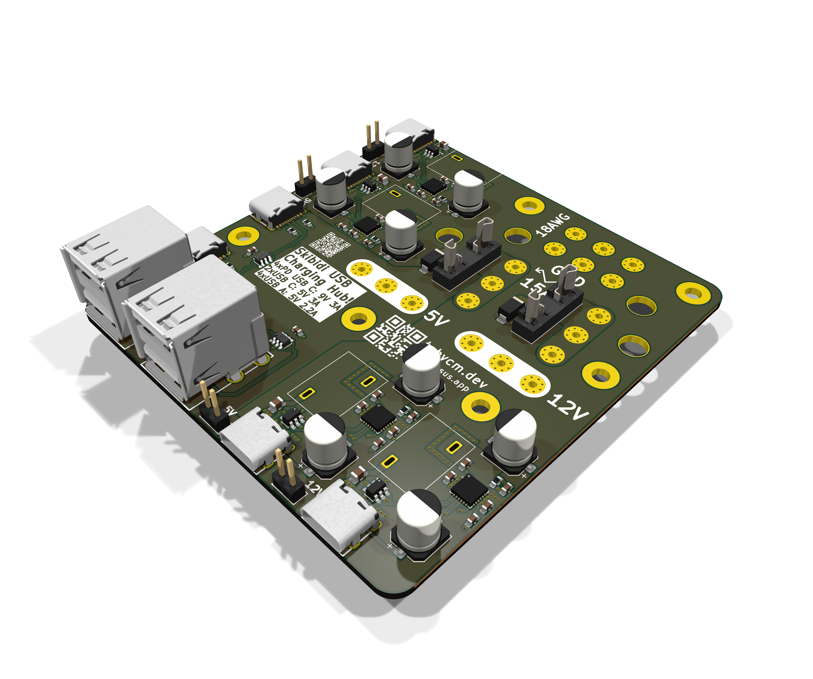
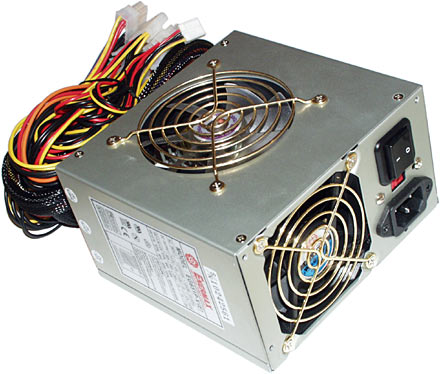
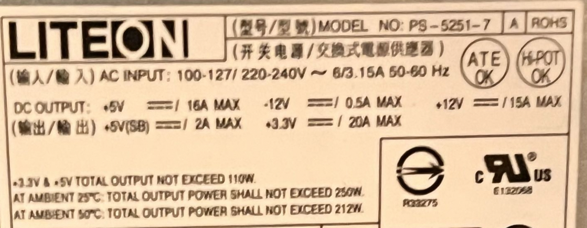
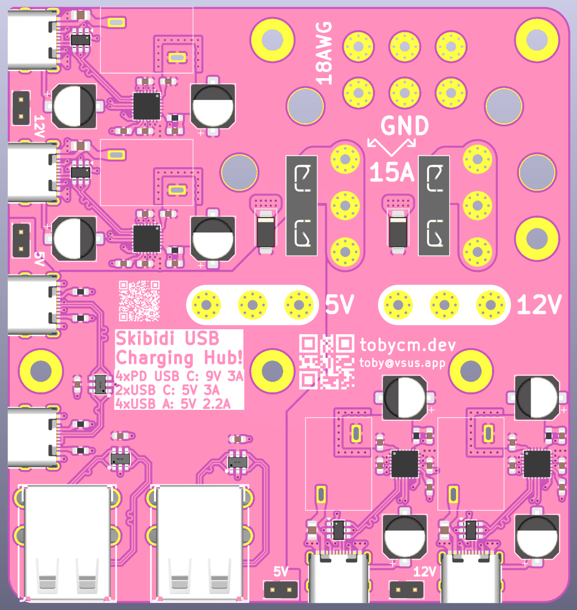
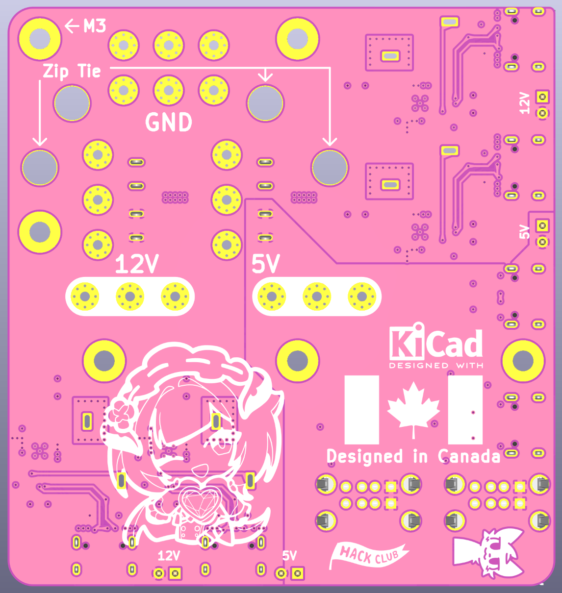

# skibidi-usb-charger-hub

a very skibidi usb charger hub. powered using an old PC PSU with 12V and 5V, providing:

- 4 x PD USB C: 9V 3A
- 2 x USB C: 5V 3A
- 4 x USB A: 5V 2.2A

     
    <strong>This project was partly sponsored by PCBWay and Hack Club</strong>
    
<a href="https://www.pcbway.com/">PCBWay</a> is a PCB manufacturing company that provides high-quality PCB services. I am happy to collaborate with them to bring this project to life. My experience with PCBWay:

    <ul>
        <li>They double check your designs before production, making sure there aren't silly mistakes that got past your DRC.</li>
        <li>Their customer service is fast and very helpful. I needed to modify my PCBA order and got a response in the same day.</li>
        <li>PCBA orders doesn't have extended component fees like JLCPCB, making it cheaper in some cases. Parts can be source from many places, like LCSC, DigiKey, etc.</li>
        <li>Lots of different colours for PCBs (thinking of a pink PCB for next project :3c)</li>
    </ul>
    

        
Pictures:

        
This is the hidden content that will be revealed.

    

    
---------

    
<a href="https://hackclub.com/">Hack Club</a> is the world's largest nonprofit movement of teenagers making cool projects. This project was partly funded by the <a href="https://fallout.hackclub.com/">Fallout</a> program from Hack Club!

## PSU

5V 16A | 12V 15A

## PCB Renders

[OnShape model](https://cad.onshape.com/documents/76d0eacda952f7a16601ad60/w/6632ab11f69bcce9ea203d2d/e/41ef5674a500edea83bbca98?renderMode=0&uiState=6a0fff0a803d90545f2c49f1)

## End notes

Made with <3 by @tobycm
